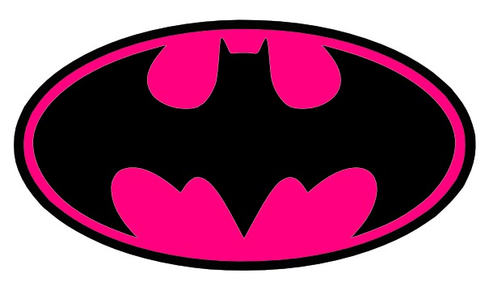

#  ASMA KAJEIOU 

**AI Developer | Machine Learning Explorer | Tech Enthusiast**

---

## 🚀 **ABOUT ME**

🎯 **Building intelligent solutions, one step at a time**

🌍 **Exploring AI and turning ideas into reality**

### 👨‍💻 Who am I?

- 🤖 **AI Developer & Digital Innovator**
- 📍 Based in **France** 🇫🇷
- 💡 Passionate about **Artificial Intelligence & Machine Learning**
- 🌱 Currently learning **Generative AI, NLP, Deep Learning**
- 🎨 **Tech enthusiast** with a passion for innovation
- 📚 Always exploring new technologies and best practices

### 💻 Core Competencies

**Programming Languages:** Python • JavaScript • TypeScript • SQL

**Frameworks:** TensorFlow • PyTorch • React • FastAPI

**Databases:** PostgreSQL • MongoDB

**Tools:** Docker • Git • VS Code

---

## 🛠️ **TECHNICAL STACK**

### 🧠 **AI & Machine Learning** *(Exploring)*

  
  
  
  
  
  

### 🌐 **Web Development**

  
  
  
  
  
  

### 🗄️ **Backend & Databases**

  
  
  
  

### ⚙️ **DevOps & Tools**

  
  
  
  
  

---

## 📊 **GITHUB STATISTICS**

  
  

  

  

---

## 🌱 **CURRENTLY LEARNING**

### 🧠 AI & Machine Learning
Large Language Models • Generative AI • Computer Vision • NLP

### 💻 Development
Microservices Architecture • Cloud Computing

### 🛠️ Tools & Technologies
Docker • Kubernetes • MLOps

### 🎯 Interests
AI Ethics • Innovation • Tech Trends

**Always curious, always learning 🚀**

---

## 🎯 **WHAT I'M WORKING ON**

- 🔭 Exploring **Generative AI** and **LLMs**
- 🌱 Building **AI-powered applications**
- 👯 Learning **Machine Learning** techniques
- 💡 Experimenting with **innovative solutions**
- 🚀 Contributing to the **AI community**

---

## 📫 **LET'S CONNECT**

---

### 💖 Passionate about technology, driven by innovation 💖

### ⭐ Feel free to explore my repositories and connect!

---

